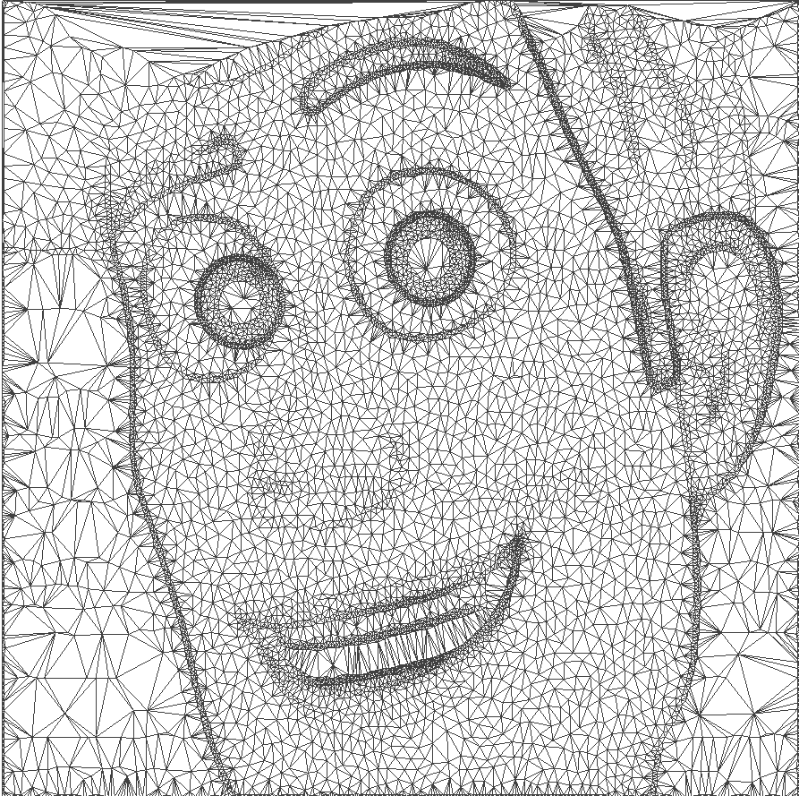

# Mesh Generation Project
## Summary ##
This program does the following in order:
1. Read a list of 3D points from the input text file. The points are assumed to be obtained as the result of a non-uniform sampling from a grayscale image. 
2. Generate the 2D Delaunay triangulation from the (x,y) coordinates of the input points.
3. Rasterize the mesh to integer grid points and write the reconstructed image to the output file.

For further implementation details please refer to the description included in file "make_mesh.cpp"

## Example ##
Consider the "boy.png" image from the "/images" folder as shown below: 

A list of non-uniformly-sampled 3D points from the "boy.png" image is provided in file "/inputs/boy_ed_4%.dat". This file is used as the input to the "make_mesh" program and a Delaunay triangulation is generated and stored in "output/boy_4%_tri.off" in .OFF format. A screenshot of the OFF file displyed by the MeshLab software is provided in file "output/boy_4%_mesh.png" as shown below:

hello

