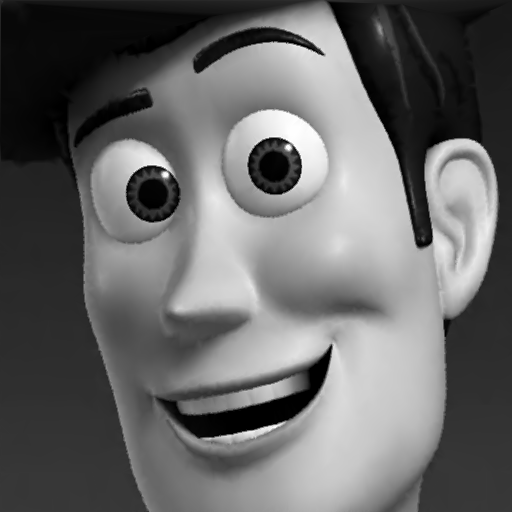

# Mesh Generation Project
## Summary ##
Thanks for your time to visit my Github page :)

Below is the summary of what the `make_mesh.cpp` code does in order:
1. Read a list of 3D points from the input text file. The points are assumed to be obtained as the result of a non-uniform sampling from a grayscale image. 
2. Generate the 2D Delaunay triangulation from the (x,y) coordinates of the input points.
3. Rasterize the mesh to integer grid points and write the reconstructed image to the output file.

Further implementation details can be found in the description included in file `make_mesh.cpp`.

## Compiler ##
Either the `g++` compiler in Linux or with MinGW in Windows can be used to build `make_mesh.cpp`.

## Library Dependencies ##
### CGAL ###
CGAL is required (https://doc.cgal.org/latest/Manual/general_intro.html). Since CGAL version 5.0, CGAL is header-only by default, which means that there is no need to compile CGAL or its libraries before it can be used. Just specify the include directory containing the "CGAL" folder in the compiler option, if it's different from the system's include directory /usr/include in a Linux system.  

### GMP ###
GMP library (https://gmplib.org/) is required.

### OpenCV ###
OpenCV (https://opencv.org/releases/) is optional. If OpenCV is installed any common image formats (.jpg, .png, ...) can be used for the output images. To enable the OpenCV functionality the `OPENVC_INSTALLED` macro must be defined in the file `include/config.hpp`. Also, in the `Makefile` set `OPENCV_INSTALLED = YES`.

## Build ##
A Makefile is provided for building the code under Linux. To build the code, go to the directory containing both `Makefile` and `make_mesh.cpp` files and run `make` to generate the executable program `make_mesh`.

Visual Studio Code can also be used for building the code either in Linux or Windows if the file `tasks.json` is configured properly. Please do not hesitate to contact me if you need further instructions on how to set that up.

## Command Line Usage ##
The command line signature is as below:

`./make_mesh -i <input_points_file> -t <output_triangulation_file> -r <output_reconstructed_image>` 

### Usage Example ###
Consider the `boy.png` image from the `/images` folder as shown below: 

A list of non-uniformly-sampled 3D points from the `boy.png` image is provided in file `/input/boy_ed_4%.dat`. The `4%` in the file name means that the file contains about only 4% of total number of pixels (~= 0.04\*512\*512) in the image. Now, consider a command line as below:

`./make_mesh -i /input/boy_ed_4%.dat -t output/boy-tri.off -r output/boy-rec-img.pnm`

This command uses the `/input/boy_ed_4%.dat` file as the input to the `make_mesh` program and a Delaunay triangulation is generated as stored in `output/boy-tri.off` in .OFF format. A screenshot of the OFF file displayed by the MeshLab software is provided in file `output/boy-mesh.png` as shown below:

Then, the mesh is rasterized to integer grid points with the resolution same as the original image (i.e., 512\*512 grid points for `boy.png`) to reconstruct the original image. The reconstructed image is written to file `output/boy-rec-img.pnm` in PNM format as shown below:

The PNM image format can be viewed online at: http://paulcuth.me.uk/netpbm-viewer/ or can be converted to other image formats at: https://convertio.co/pnm-png/. Just to grab your attention, this image was reconstructed using only 4% of all the pixels in the original image. 

If OpenCV library is installed on your machine any common image formats (i.e., .jpg, .png, ...) can be used in the output image name. 

## Contact ##
Please report any problems and bugs to ali.mostafavian@gmail.com
